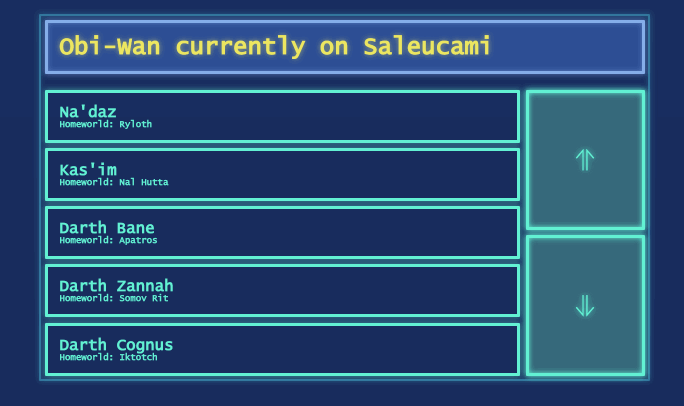
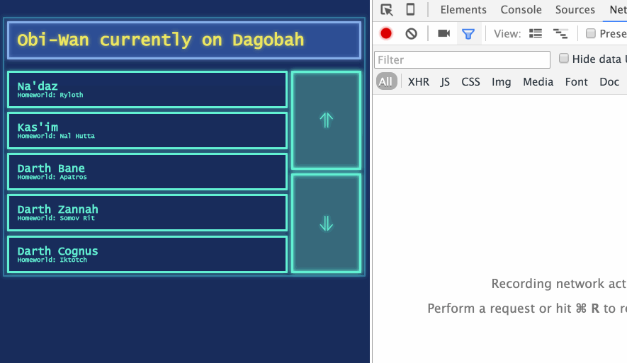
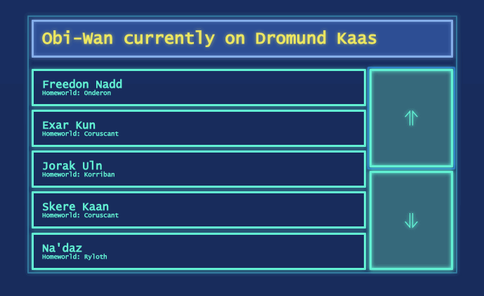
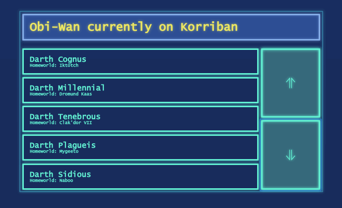

# Flux/React Challenge

## Database reader of Sith lords

### Background

You are Obi-Wan Kenobi's "IT" assistant at the Jedi Council, and your job is to create a User Interface for the Sith Database. Obi-Wan is travelling around the galaxy visiting many planets, doing an investigation. It is rumored that the homeworld of every Dark Jedi has a distinctive Sith emblem marked on their house where they were born/raised, and Obi-Wan wants to check if this rumor is true.

The Jedi Master requested you to make a dashboard-like UI showing a list of Sith lords sorted by apprenticeship (row `N` is the Sith Lord who was master of the Dark Jedi below at row `N+1`). The dashboard also shows at the top the current planet which Obi-Wan is visiting at the moment. The UI is supposed to verify if any of those Dark Jedis currently displayed on the list was born at the planet Obi-Wan is currently visiting, and if any, display that Dark Jedi in red.

### Requirements

- Data for current planet indicator comes from WebSocket connection to `ws://localhost:4000` and is displayed at the top of the page.


- Make requests to `http://localhost:3000/dark-jedis/` to populate the list. The first request must be to get Darth Sidious: `http://localhost:3000/dark-jedis/3616`
    * The HTTP response for one row tells the URL for the next row `response.apprentice.url` and the previous row `response.master.url`.

- Scroll buttons: up/down buttons, move the list 2 positions

- When scrolled, load more rows one at a time to fill in the blanks. Don't cache data, always request new data. (Other users might make live changes (typo fixing etc) to the data and Obi-Wan asked you to always make fresh requests)



- Do not make any request for a sith that would be outside the list. Cancel any such obsolete request when the user scrolls.



- When either the current planet indicator changes OR loaded new rows: check if there is a displayed Dark Jedi whose home planet matches the current planet. If true, then display that Dark Jedi in red text, and cancel ALL ongoing HTTP requests for rows. Freeze the UI from scrolling until the current planet changes again and there is no red-highlighted Dark Jedi anymore.



- The list cannot be scrolled down if the last known sith has no apprentice. The list cannot be scrolled up if the first known sith has no master. Use `.css-button-disabled` on the buttons to indicate this status.



- Use CSS classes from `styles.css` to style the HTML, which should look roughly like this (remember you'll be writing in React):

```html
<div class="app-container">
  <div class="css-root">
    <h1 class="css-planet-monitor">Obi-Wan currently on Tatooine</h1>

    <section class="css-scrollable-list">
      <ul class="css-slots">
        <li class="css-slot">
          <h3>Jorak Uln</h3>
          <h6>Homeworld: Korriban</h6>
        </li>
        <li class="css-slot">
          <h3>Skere Kaan</h3>
          <h6>Homeworld: Coruscant</h6>
        </li>
        <li class="css-slot">
          <h3>Na'daz</h3>
          <h6>Homeworld: Ryloth</h6>
        </li>
        <li class="css-slot">
          <h3>Kas'im</h3>
          <h6>Homeworld: Nal Hutta</h6>
        </li>
        <li class="css-slot">
          <h3>Darth Bane</h3>
          <h6>Homeworld: Apatros</h6>
        </li>
      </ul>

      <div class="css-scroll-buttons">
        <button class="css-button-up"></button>
        <button class="css-button-down"></button>
      </div>
    </section>
  </div>
</div>
```


### Submission

- Edit `submission/verbling/` with your code
- Place all your client-side code in that repository, must include `index.html` in your submission folder.
- Run the server like this: `cd server` then `npm install` (just once) then `npm start`.
- Remember to use `styles.css` in your `index.html` solution.
- To build the Javascript bundle, use `webpack`. (`webpack --watch` to watch files)
- When you are done, please contact us with link to your repo, preferably on GitHub.
- Please do not copy or plagiarize other submissions, it's easy to spot.


### Criteria

- Must be React. We use ES6 features, but you are free not to.
- Preferably a Flux-like architecture, but if you feel like you can use anything
- Must solve the requirements listed above
- As elegant code as possible

**Elegance** here is not a subjective criteria. Let's define code elegance to be "*the ability of a programmer to easily understand the program's flow and state coordination, being completely familiar with the tools used but completely unfamiliar with the codebase*". Special attention is given to "familiar with the tools" and "unfamiliar with the codebase". This means if I know nothing about ClojureScript, a ClojureScript solution to this problem might still be very elegant to an experienced ClojureScript developer. On the other hand, unfamiliarity with the codebase is important to determine that, because usually as you grow familiar with a codebase, you find it easier to understand how it works. **Our objective is to make it easy for a peer programmer to join a codebase and quickly understand how it works.**

### Purpose

This challenge is meant to be solved with Flux or some variation of this architecture, such as architectures with the single state tree and "actions" (Om, Redux, etc).
